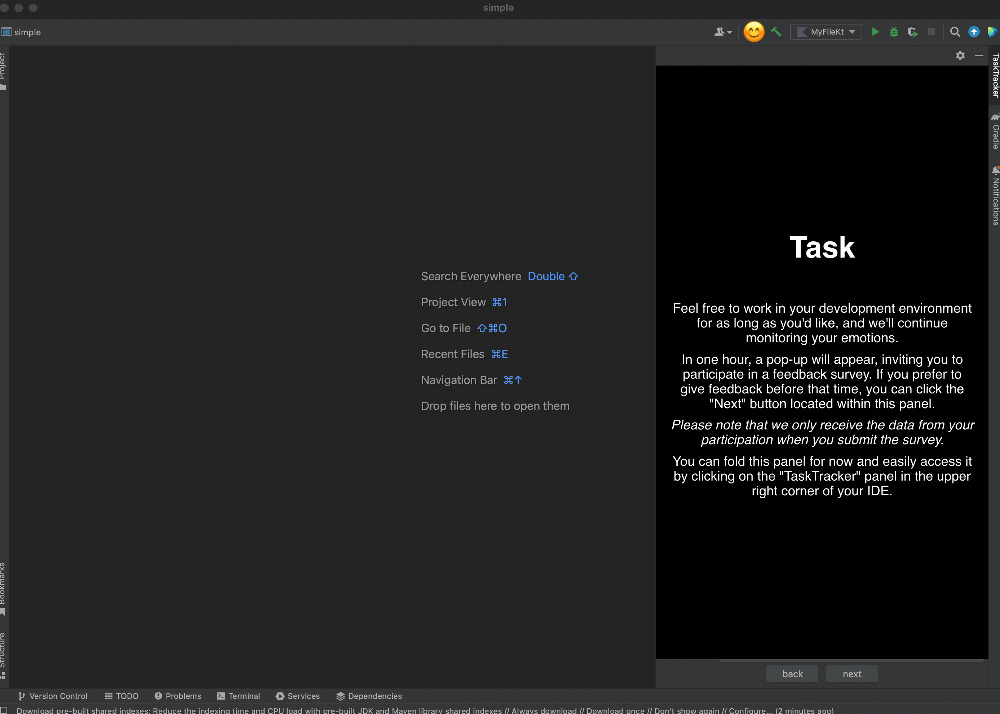

# JetBrains Hackathon 2023

> **Warning**
>
> The current version of the plugin was developed during the hackathon and can be unstable.

CodeMood – the revolutionary plugin that understands and affirms your emotions while you code!

To install the plugin, download the `zip` archive by the following link TODO and install thought the plugins section.
If you have any difficulties, follow the official [documentation](https://www.jetbrains.com/help/idea/managing-plugins.html#install_plugin_from_disk).

The plugin will ask you permission to record the coding session using one of available video devices.
_We don't send the photos to a server and handle them locally._

You can click on the plugin icon to pop up a dashboard with an emoticon reflecting the programmer's current emotion:

In the end of the coding session you might fill out a short survey about your feelings. 

**Download CodeMood today and start coding with emotions in harmony.**
